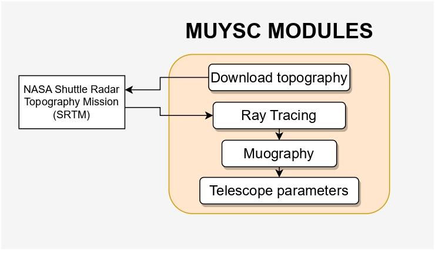

# MUYSC (Muography Simulation Code)


<div align="center">
  
</div>


MUYSC is a muography simulation framework capable of rapidly estimating rough muograms of any geological structure worldwide. MUYSC generates the muon flux at the observation place, transports the muons along the geological target, and determines the integrated muon flux detected by the telescope. Additionally, MUYSC computes the muon detector parameters (acceptance, solid angle, and angular resolution) and reconstructs the 3-dimensional density distribution of the target. MUYSC was born from the mute project to provide a first approximation for a real muography study.


## Modules 🔨




* Download topography data of the geological structure.
* Distances traveled in muon section
* Calculation of the integrated muon flux
<details>
  <summary><h2>Parameter of the telescope</h2></summary>

  
This script, `telescopeParams.py`, provides a Python class to calculate several telescope parameters given the number of bars, pixel size, panel separation, and the distance from the volcano. 

## Class: telescopeParams

This class takes in the following parameters: 

- `nBars`: Number of bars in the telescope
- `d`: Pixel size in cm
- `D`: Panel separation 
- `L`: Distance from the volcano in meters

The `telescopeParams` class contains several methods which are used to calculate various parameters of the telescope and display plots of these parameters.

## Class Methods

The methods in the class are as follows:

- `__init__`: This is the constructor for the `telescopeParams` class.

- `create_plot`: This method creates a plot of given data with labels, axes, and colorbars.

- `solid_angle`: This method calculates the solid angle of the telescope given its parameters.

- `N_pixel`: This method calculates the number of pixels given the telescope's parameters.

- `acceptance`: This method calculates the acceptance of the telescope.

- `S_pixels`: This method calculates the S_pixel parameter.

- `create_subplot`: This method creates a subplot given data, a colorbar label, and an axis.

- `plot_all_params`: This method creates a 2x2 grid of subplots containing the solid angle, number of pixels, acceptance, and S_pixel.

## Example Usage:

```python
nBars_value = 40  # Assume some value for the number of bars
d_value = 1  # Assume some value for pixel size in cm
D_value = 150  # Assume some value for panel separation
L_value = 50  # Assume some value for distance from the volcano in meters
cmap = "jet" # Color map
# Create an object of the telescopeParams class
my_telescope = telescopeParams(nBars_value, d_value, D_value, L_value, cmap)

# Calculate and plot different parameters of the telescope
my_telescope.solid_angle()
my_telescope.N_pixel()
my_telescope.acceptance()
my_telescope.S_pixels()
my_telescope.plot_all_params()
```
In this example, an instance of `telescopeParams` is created with given parameter values. The different methods are then called on this instance to calculate the telescope parameters and plot them.

Note: The plotting functions in this script rely on Matplotlib, so ensure you have that library installed before running.


</details>


## Requirements
* Python 3.7 >
* NumPy
* Matplotlib
* SRTM


## Installation

Go to your terminal and type the command:

```
$ pip install MUYSC
```
See the documentation and examples included in this repository for information on how to use MUYSC in your own muography applications.


## Documentation :books:
The documentation will be available in [Mute page](https://halley.uis.edu.co/fuego/muysc/) and in the [wiki](https://github.com/Jhosgun/MUYSC/wiki) of this repository.


## Contribution
Contributions to the MUYSC project are welcome. Please follow the guidelines below to contribute:

Make a fork of this repository and make your changes in a separate branch.
Make sure your code complies with the project's style and quality standards.
Write proper tests and documentation for your changes.
Submit a pull request detailing your changes and why they are needed.

## License
MUYSC is licensed under the creative commons.

## Publicaciton :mortar_board:
You can read more about our project clicking [here](https://www.researchgate.net/publication/369035316_MUYSC_An_end-to-end_muography_simulation_toolbox)

## Team ✒️
* Jesus Peña [JesusPenha](https://github.com/JesusPenha)
* Jorge Jaimes [Jhosgun](https://github.com/Jhosgun)
* Kevin Dlaikan 
## Contact
If you have any questions or suggestions about MUYSC, please contact us by e-mail at jorge2170083@correo.uis.edu.co.
