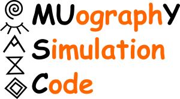

# MUYSC (Muography Simulation Code)

MUYSC implements a muography simulation framework capable of rapidly estimating rough muograms of any geological structure worldwide. MUYSC generates the muon flux at the observation place, transports the muons along the geological target, and determines the integrated muon flux detected by the telescope. Additionally, MUYSC computes the muon detector parameters (acceptance, solid angle, and angular resolution) and reconstructs the 3-dimensional density distribution of the target. 

### Modules

Simulación de trayectorias de partículas en ambientes geológicos.
Modelado de la atenuación de la señal en diferentes condiciones geológicas.
Análisis de datos de muografía para aplicaciones geofísicas y geológicas.
Herramientas de visualización para facilitar la interpretación de resultados.

## Requirements
Python 3.x
NumPy
Matplotlib
SRTM.py

## Installation
Clone this repository:

bash
Copy code
git clone https://github.com/username/MUYSC.git
Install the dependencies:

Copy code
pip install -r requirements.txt
Run a simulation example:

Copy code
python example.py
Using
See the documentation and examples included in this repository for information on how to use MUYSC in your own muography applications.

The documentation will be available in /documentation and in the wiki of this repository.

## Contribution
Contributions to the MUYSC project are welcome. Please follow the guidelines below to contribute:

Make a fork of this repository and make your changes in a separate branch.
Make sure your code complies with the project's style and quality standards.
Write proper tests and documentation for your changes.
Submit a pull request detailing your changes and why they are needed.

## License
MUYSC is licensed under the creative commons.

## Contact
If you have any questions or suggestions about MUYSC, please contact us by e-mail at jorge2170083@correo.uis.edu.co.
